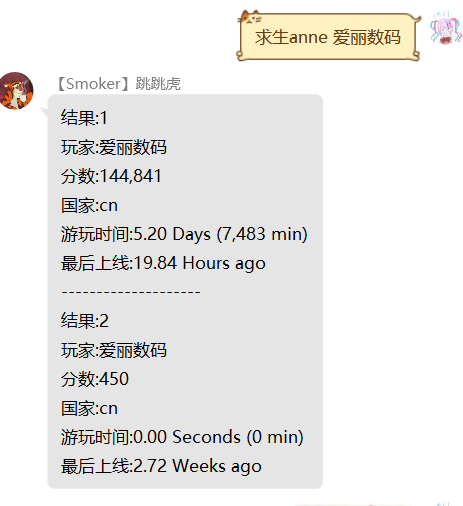
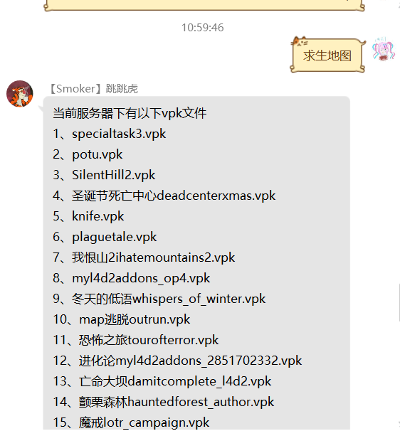
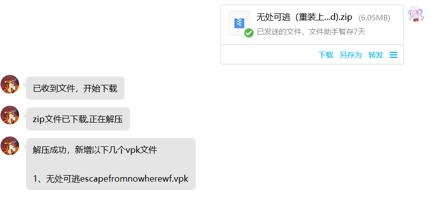

  
   
  

# nonebot_plugin_l4d2_server
_✨Nonebot & Left 4 Dead 2 server操作✨_

# 最近更新
更新了查询anne的信息~ 
使用指令(求生anne[text]) 
也可以使用(求生绑定[text])来绑定昵称或steamid,就可以不带参数查询了 
如果后面艾特人，则查娶该用户的绑定信息

## 安装
    1、nb plugin install nonebot_plugin_l4d2_server
    2、pip install nonebot_plugin_l4d2_server
    3、Download zip

## 前置操作

- 创建一个steam求生服务器(预计需要储存14G)

展开/收起

### 以ubuntu为例，具体教程建议自行搜索，其中路径可以自行替换

- 安装32位运行库

        sudo apt-get update
        sudo apt-get upgrade
        sudo apt-get install lib32gcc1

- 下载steam

        mkdir ~/steamcmd
        cd ~/steamcmd
        wget https://steamcdn-a.akamaihd.net/client/installer/steamcmd_linux.tar.gz
        tar -zxvf steamcmd_linux.tar.gz
        ./steamcmd.sh

- 下载l4d2文件

        Steam> force_install_dir /home/ubuntu/coop
        Steam> login anonymous
        Steam>app_update 222860 validate
出现Success! App ‘222860’ fully installed后，输入quit或者exit

- 创建启动脚本

        sudo vi /home/ubuntu/coop/cfg/server.cfg
写入

        hostname "xxx"     //游戏服务器名(英文)
        sv_steamgroup "114514"     //Steam组号
        sv_steamgroup_exclusive 1 //将服务器设为Steam组私有
        sv_allow_lobby_connect_only 0
        sm_cvar sv_gametypes "coop"//设置游戏模式为合作
        //设为1可防止玩家加入感染者方，仅战役模式
        sm_cvar director_no_human_zombies "1"
        mp_gamemode "coop"//激活游戏模式为合作
        z_difficulty "Hard"//设置游戏难度为困难
        sm_cvar sb_all_bot_game 1// 防止人数不足而自动关闭
        sv_tags "hidden" //防止DDos攻击
        sm_cvar sv_region 4// 设定服务器区域为亚洲
        sv_visiblemaxplayers 8 //服务器可见最大玩家数
        maxplayers 8 //最大玩家数

:wq回车保存

        cd ~
        sudo vi start.sh

在脚本里写入

        cd /home/ubuntu/l4d2
        sudo ./srcds_run -game left4dead2 +exec server.cfg

- 启动游戏

        cd ~
        sh start.sh

- 机器人与求生服务器处于同一个服务器位置

## env配置
| 配置项 | 必填 | 默认值 | 说明 |
|:-----:|:----:|:----:|:----:|
| l4_file | 是 | "/home/ubuntu/l4d2/coop" | 输入求生服务器的绝对路径,该目录下有游戏启动程序srcds_run |
| l4_image | 否 | False | 布尔值，查看地图的时候显示图片(字体为simsun.ttc，安装过才能设置为True) |
| l4_steamid | 否 | False | 布尔值，默认在输出时隐藏steamid，需要则设置为True |

## 功能
（被动）上传地图：私发压缩包zip/vpk文件给机器人，就可以直接上传地图到服务器了

| 指令 | 范围 | 用途 | 说明 |
|:-----:|:----:|:----:|:----:|
| 求生地图/查看求生地图 | 所有人 | 看图 | 获取当前路径下所有的vpk文件，并输出目录 |
| 求生anne[text] | 所有人 | 查anne成绩 | [text]可以是:空白(则使用绑定信息)|昵称|steamid|@user |
| 求生绑定/steam绑定/anne绑定[text] | 所有人 | 绑定steam信息 | [text]可以是:昵称|steamid |
| 求生解绑/steam解绑/anne解绑 | 所有人 | 解绑steam信息 | 无 |
| (求生)地图删除[number] | 群管/超管 | 删图 | 根据求生地图列出的序号，删除地图，[number]可以在第二条消息内输入 |
| 求生地图[number][改/改名][text] | 群管/超管 | 改图名 | [number]同上，text为更改后名称，如果没有.vpk后缀会自动加上 |

## 📝 TODO LIST

展开/收起

- [x] anne信息绑定qq号
- [ ] 帮助命令
- [x] 支持修改下载地图，在服务器端的名称
- [x] 支持查询并删除服务器已有地图文件
- [ ] 支持查询服务器状态
- [ ] 支持多服务器切换
- [ ] 在q群里执行服务器指令

## 已知BUG

- [ ] 无法在python3.10版本下解压7z格式压缩包
- [ ] 所有人都可以私聊发送文件
- [ ] 更改地图名称后，排序会错误

## 效果展示
anne:
 
群聊：
 
私聊：

## 📝 更新日志

展开/收起

### 0.1.3

- 新增绑定昵称和steamid
- 新增可以艾特人查询anne成绩
- 新增解绑信息

### 0.1.2

- 新增支持图片输出
- 新增查询anne服数据

### 0.1.1

- 新增删除地图
- 新增地图改名
- 新增支持图片输出

### 0.1.0

- 集中修复了Bug

### 0.0.9

- 新增上传地图后，检测对比回复新地图名字
- 修复中文名乱码问题

### 0.0.8

- 支持vpk格式地图
- 支持查看所有vpk格式文件

### 0.0.6

- 修复了7z压缩包的方式，优化代码

### 0.0.1

- 插件初次发布，可私聊添加地图

## 已测试环境
win10 python3.9  
ubuntu20.04 python3.10
