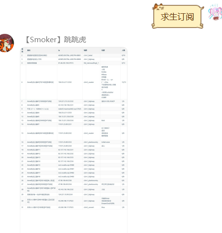

  
   
  

# nonebot_plugin_l4d2_server
_✨Nonebot & Left 4 Dead 2 server操作✨_

    

# 主要功能
- 求生服务器本地操作
- 批量查询指定ip服务器状态和玩家
- [求生电信服anne](https://sb.trygek.com/l4d_stats/ranking/index.php)查询~

## 安装
    1、nb plugin install nonebot_plugin_l4d2_server
    2、pip install nonebot_plugin_l4d2_server
    3、Download zip

## 前置操作

- 如果要操作求生服务器文件，机器人与求生服务器处于同一个服务器上

- 如果你按照以下步骤操作，env配置可以不填

- 创建一个steam求生服务器(预计需要储存14G)

展开/收起

### 以ubuntu为例，具体教程建议自行搜索，其中路径可以自行替换

- 安装32位运行库

        sudo apt-get update
        sudo apt-get upgrade
        sudo apt-get install lib32gcc1

- 下载steam

        mkdir ~/steamcmd
        cd ~/steamcmd
        wget https://steamcdn-a.akamaihd.net/client/installer/steamcmd_linux.tar.gz
        tar -zxvf steamcmd_linux.tar.gz
        ./steamcmd.sh

- 下载l4d2文件

        Steam> force_install_dir /home/ubuntu/coop
        Steam> login anonymous
        Steam>app_update 222860 validate
出现Success! App ‘222860’ fully installed后，输入quit或者exit

- 创建启动脚本

        sudo vi /home/ubuntu/coop/cfg/server.cfg
写入

        hostname "xxx"     //游戏服务器名(英文)
        rcon_password "114514"  //rcon密码
        sv_steamgroup "114514"     //Steam组号
        sv_steamgroup_exclusive 1 //将服务器设为Steam组私有
        sm_cvar sv_gametypes "coop"//设置游戏模式为合作
        //设为1可防止玩家加入感染者方，仅战役模式
        sm_cvar director_no_human_zombies "1"
        mp_gamemode "coop"//激活游戏模式为合作
        sm_cvar z_difficulty "Hard"//设置游戏难度为困难
        sv_tags "hidden" //防止DDOS
        sm_cvar sv_region 4// 设定服务器区域为亚洲
        sv_visiblemaxplayers 8 //服务器可见最大玩家数
        maxplayers 8 //最大玩家数

:wq回车保存

        cd ~
        sudo vi start.sh

在脚本里写入

        cd /home/ubuntu/l4d2
        sudo ./srcds_run -game left4dead2 -condebug -tickrate 60 +exec server.cfg +map c2m1_highway

- 启动游戏

        cd ~
        sh start.sh

## 🤔 功能（指令）

### 服务器

（被动）上传地图：私发压缩包zip/vpk文件给机器人，就可以直接上传地图到服务器了
        [ip]格式为[127.0.0.1:20715]括号内

展开/收起

| 指令 | 范围 | 用途 | 说明 |
|:-----:|:----:|:----:|:----:|
| 求生地图/查看求生地图 | 所有人 | 看图 | 获取当前路径下所有的vpk文件，并输出目录 |
| (求生)地图删除[number] | 群管/超管 | 删图 | 根据求生地图列出的序号，删除地图，[number]可以在第二条消息内输入 |
| 求生地图[number][改/改名][text] | 群管/超管 | 改图名 | [number]同上，text为更改后名称，如果没有.vpk后缀会自动加上 |
| 求生服务器指令[text] | 群管/超管 | 控制台 | rcon连接求生服务器控制台,建议设置l4_host、l4_port、l4_rcon，l4_rcon不设置会尝试自动获取 |

### anne(电信服)

| 指令 | 范围 | 用途 | 说明 |
|:-----:|:----:|:----:|:----:|
| 求生anne[text]/@/[None] | 所有人 | 查anne成绩 | [text]可以是:空白(则使用绑定信息)|昵称|steamid|@user |
| 求生绑定/steam绑定/anne绑定[text] | 所有人 | 绑定steam信息 | [text]可以是:昵称|steamid |
| 求生解绑/steam解绑/anne解绑 | 所有人 | 解绑steam信息 | 无 |

### ip(服务器查询)

| 指令 | 范围 | 用途 | 说明 |
|:-----:|:----:|:----:|:----:|
| 求生ip[ip] | 所有人 | 查指定服务器 | [text]格式为[127.0.0.1:20715]括号内，可以查询服务器玩家名字 |
| 求生订阅[ip] | 所有人 | 查询订阅服务器状态 | 返回一个图片，显示群所有订阅的服务器名字、状态、地图、玩家名字 |
| 求生加入[number] | 所有人 | 获取进服直链 | [number]为求生订阅所显示的开头序号 |
| 求生添加订阅[ip] | 群管 | 群订阅添加 | 新增订阅ip，在下次订阅的时候可以显示 |
| 求生取消订阅[number] | 所有人 | 群订阅取消 | [number]为求生订阅所显示的开头序号 |

### 其他功能

| 指令 | 范围 | 用途 | 说明 |
|:-----:|:----:|:----:|:----:|
| 创意工坊下载[text] | 所有人 | 下载创意工坊文件 | [text]为id或者网页url |

## ✅ env配置

展开/收起

###本地服务器相关
| 配置项 | 必填 | 默认值 | 说明 |
|:-----:|:----:|:----:|:----:|
| l4_file | 否 | "/home/ubuntu/l4d2/coop" | str,输入求生服务器的绝对路径,该目录下有游戏启动程序srcds_run |
| l4_host | 否 | '127.0.0.1' | str，服务器ip，如果是本机一般就是默认 |
| l4_port | 否 | 20715 | int，服务器端口号 |
| l4_rcon | 否 | '114514' | str，服务器的rcon密码 |

###可选填写
| 配置项 | 必填 | 默认值 | 说明 |
|:-----:|:----:|:----:|:----:|
| l4_steamid | 否 | False | 布尔值，默认在输出时隐藏steamid，需要则设置为True |
| l4_image | 否 | True | 布尔值，是否显示图片 |
| l4_font | 否 | 'simsun.ttc' | str，确保在开启图片的时候，字体存在 |

## ✨ 效果展示
订阅: 
 
anne: 
 
群聊： 
 
私聊： 
 

## 🤔 FAQ

        Q:UnicodeDecodeError: 'utf-8' codec can't decode byte 0xd0 in position xxx: invalid continuation byte</b>
        A:说明rcon连接服务器时返回了乱码，有可能读取的信息包含表情包或者其他不明字符，我的方法是找到本地pypi包的rcon，编辑rcon/source/async_rcon.py,找到return response.payload.decode(encoding)并替换为return response.payload.decode(encoding,errors='ignore')

## 📝 TODO LIST

展开/收起

- [ ] 帮助命令
- [ ] 创意工坊内容下载并上传q群
- [ ] 求生每日签到/抽签
- [ ] 按照数值自定义绘画信息图片
- [ ] 支持直接修改本地cfg文件
- [ ] 支持远程连接求生服务器并操作
- [ ] 搭建python编写求生之路服务器插件框架

## 🐛  已知BUG

展开/收起

- [ ] 无法在python3.10版本下解压7z格式压缩包
- [ ] 所有人都可以私聊发送文件
- [ ] 更改地图名称后，排序会错误
- [ ] 服务器指令如果使用更换地图或重启，服务器会因为无响应，而返回无法连接

## 🔖 更新日志

展开/收起

### 0.2.0--2022.1.21

 - 新增创意工坊查询
 - 优化查询图片UI
 - 新增创意工坊文件下载
 - 修复了因为电信服官网前端修改导致查询失败的BUG

### 0.1.7--2022.1.19

 - 新增群ip订阅，批量查询
 - 新增图片显示ip状态
 - 修复了因为玩家名字特殊字符导致的utf-8解码错误
 - 更新自己的第三方库VSQ==0.0.6

### 0.1.6--2022.1.15

 - 新增ip查询服务器提供玩家数量和名字
 - 增加协程函数修复因为加载顺序导致的错误
 - 更新自己的第三方库VSQ==0.0.4

### 0.1.5--2022.1.15

- 新增服务器控制台指令，新增依赖rcon
- 重新了数据库，不再使用json而是使用sql3
- 改写了求生anne信息显示方式：如果单个数据以图片显示，如果多个数据以文字显示

### 0.1.4--2022.1.9

- 新增求生anne详情（看排名）
- 所有的请求改为httpx
- 更新了anne信息图片
- 可选使用模拟谷歌浏览器来获取anne更多数据（~有点屎了，希望大佬救救~)

### 0.1.3--2022.1.7

- 新增绑定昵称和steamid
- 新增可以艾特人查询anne成绩
- 新增解绑信息

### 0.1.2--2022.1.6

- 新增支持图片输出
- 新增查询anne服数据

### 0.1.1--2022.1.5

- 新增删除地图
- 新增地图改名
- 新增支持图片输出

### 0.1.0--2022.1.4

- 集中修复了Bug

### 0.0.9--2022.1.4

- 新增上传地图后，检测对比回复新地图名字
- 修复中文名乱码问题

### 0.0.8--2022.1.4

- 支持vpk格式地图
- 支持查看所有vpk格式文件

### 0.0.6--2022.1.3

- 修复了7z压缩包的方式，优化代码

### 0.0.1--2022.1.3

- 插件初次发布，可私聊添加地图

## ✨ 开发环境
win10 python3.9  
ubuntu20.04 python3.10

## 感谢
- 1、[修仙插件的数据库写法](https://github.com/s52047qwas/nonebot_plugin_xiuxian)
- 2、[自己写的求生之路查询库](https://github.com/Umamusume-Agnes-Digital/VSQ)
- 3、[可爱小Q的帮助~还没抄完~](https://github.com/MeetWq/mybot)

